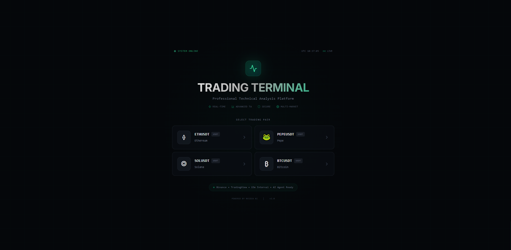
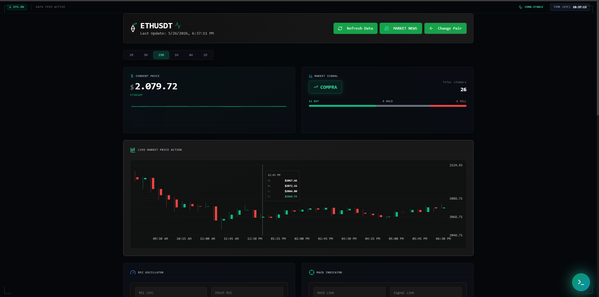
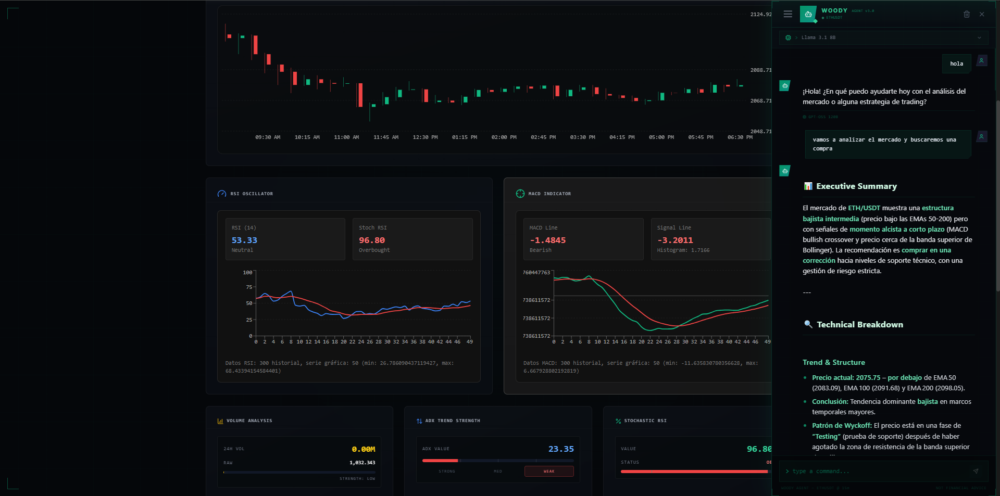
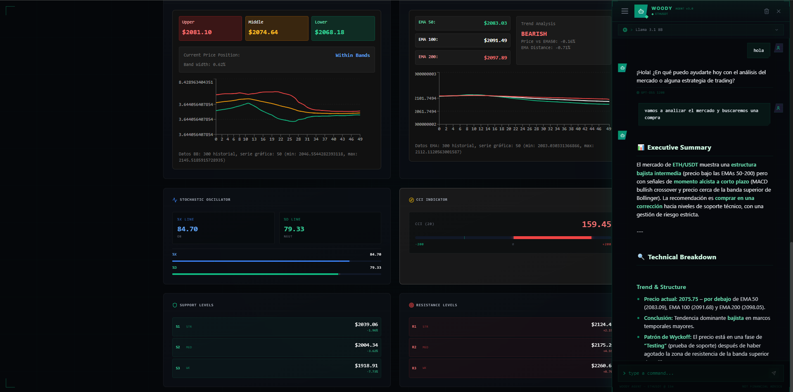
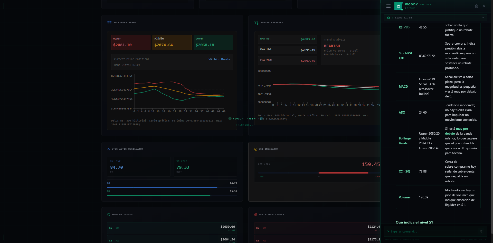

# Trading Bot UI

## 📊 Description
This project is a professional-grade cryptocurrency trading interface that retrieves real-time market data directly from the TradingView API. It is designed to empower traders with advanced technical analysis tools and a modern, responsive user experience. The platform integrates a robust set of technical indicators, allowing users to analyze price trends, identify trading opportunities, and make informed decisions. Additionally, it now features an AI-powered technical analysis agent capable of generating market insights, detecting patterns, evaluating indicators, and assisting traders with smarter decision-making in real time. Built with Next.js for the frontend and Python for the backend, it seamlessly combines performance, flexibility, and a visually appealing dashboard for both novice and experienced traders.

## ✨ Features

- 🎯 Intuitive dashboard with real-time technical indicators
- 💹 Advanced price and trend visualization
- 🔄 Customizable cryptocurrency selector
- 📱 Responsive design for all devices
- 🌓 Integrated light/dark theme
- 📊 Interactive and dynamic charts
- 🤖 Python backend for technical analysis

## 🚀 Technologies

### Frontend


### Backend


## 🛠️ Installation

1. Clone the repository:
```bash
git clone https://github.com/Erick-MC-Cedeno/Technical-Analysis-Interface-For-Trading
```

```
cd Technical-Analysis-Interface-For-Trading
```

2. Install frontend dependencies:
```bash
pnpm install
# or
pnpm install --force
```

3. Install backend dependencies:
```bash
cd backend
pip install -r requirements.txt
```

## 🚀 Usage

1. Start the backend server:
```bash
python app.py
```

2. In another terminal, start the frontend:
```bash
pnpm run dev
# or
ppnpm dev
```


3. Open [http://localhost:3000](http://localhost:3000) in your browser.

## 📷 Capturas de pantalla

A continuación se muestran imágenes de la interfaz:

### Card


### Dashboard 1


### Dashboard 2


### Dashboard 3


### Loader


## 💡 Project Structure

```
├── app/                  # Next.js configuration and main pages
├── components/          # Reusable React components
│   ├── indicators/     # Technical indicator components
│   └── ui/            # UI components
├── backend/            # Python server and analysis logic
├── utils/             # Utilities and helpers
└── public/            # Static files
```

## 📄 License

MIT

## 👥 Contributing

Contributions are welcome. Please open an issue first to discuss what you would like to change.


